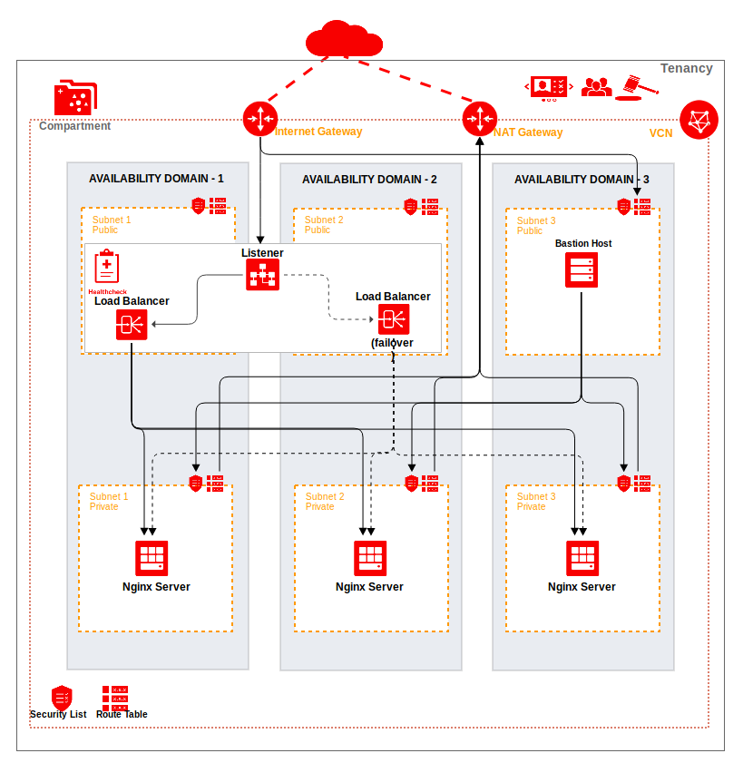

## Create Virtual Cloud Network and Deploy Load Balancer
This example shows how to deploy the nginx servers with public Load Balancer on Oracle Cloud Infrastructure using the Terraform module. It will create the following things:

* A virtual cloud network with two subnets (each in a different availability domain) and an internet gateway
* Two nginx servers running (in different subnets)
* A bastion host to setup the nginx servers
* A public load balancer



### Using this example
Prepare one variable file named "terraform.tfvars" with the required information. The content of "terraform.tfvars" should look something like the following:

```bash
$ cat terraform.tfvars
# Oracle Cloud Infrastructure Authentication details
tenancy_ocid = "ocid1.tenancy.oc1..xxxxxxxxxxxxxxxxxxxxxxxxxxxxxxxxxxxxxxxxxxxxxxxxxxxxxxxxxxxx"
user_ocid = "ocid1.user.oc1..xxxxxxxxxxxxxxxxxxxxxxxxxxxxxxxxxxxxxxxxxxxxxxxxxxxxxxxxxxxx"
fingerprint= "xx:xx:xx:xx:xx:xx:xx:xx:xx:xx:xx:xx:xx:xx:xx:xx"
private_key_path = "~/.oci/oci_api_key.pem"
region = "us-ashburn-1"
compartment_id = "ocid1.tenancy.oc1..xxxxxxxxxxxxxxxxxxxxxxxxxxxxxxxxxxxxxxxxxxxxxxxxxxxxxxxxxxxx"

# Instance Configration
server_ssh_authorized_keys = "~/.ssh/id_rsa.pub"
server_ssh_private_key = "~/.ssh/id_rsa"
server_count=2
http_port="80"
```

Please also note that the self signed certificate generated in the example is for demo purposes only.

### Run the example:

```bash
$ terraform init
$ terraform plan
$ terraform apply
```

### To delete all resources:

```bash
$ terraform destroy
```
